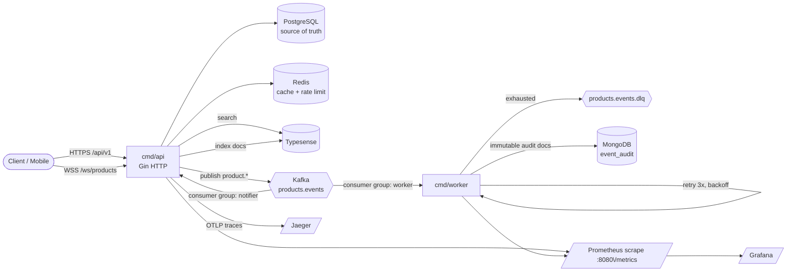

# Golang BE

**Production-grade, event-driven REST API** built with Go — portfolio pribadi yang meniru arsitektur mid-to-large backend: polyglot persistence, event streaming + DLQ, observability, dan CI/CD.

[](https://go.dev/)
[](https://gin-gonic.com/)
[](docs/GITLAB-SETUP.md)
[]()

---

## Tujuan proyek (portfolio)

Repo ini dibuat sebagai **porto pribadi** untuk menunjukkan kemampuan membangun backend “kelas menengah ke atas”: bukan CRUD tipis, tapi keputusan arsitektur yang mirip yang dipakai di produk nyata (event-driven, polyglot DB, worker, k8s, observability).

Bukan berarti harus jalan di cluster 100 node — **right-sized**: satu box Ubuntu + k3s + Docker Compose sudah cukup untuk demo yang kredibel.

**Dokumen belajar praktis:** [`docs/PANDUAN-BELAJAR.md`](docs/PANDUAN-BELAJAR.md) · **Setup GitLab:** [`docs/GITLAB-SETUP.md`](docs/GITLAB-SETUP.md)

---

## Why this project exists

- **Event-driven** — domain events lewat **Kafka** → worker → audit **MongoDB** + fan-out **WebSocket**
- **Reliability** — retry + **DLQ**, circuit breaker search, graceful shutdown
- **Observability** — Prometheus / Grafana / OTel / Loki (opt-in)
- **Polyglot persistence** — PostgreSQL + Redis + MongoDB + Typesense
- **Security** — JWT + RBAC, rate limit, API key, OWASP headers; secrets via env/K8s Secret (bukan hardcoded)
- **Delivery** — **GitLab CI** (lint → test → build → Trivy → registry) + **k3s** zero-downtime rolling update
- **Right-sized** — hardware terbatas (≈4-core / 8GB)

---

## Impact & trade-off stack ini

| Keputusan | Manfaat (porto / skill) | Biaya / dampak |
|-----------|-------------------------|----------------|
| Banyak datastore (PG + Redis + Mongo + Typesense) | Tunjukkan *polyglot persistence* & bounded context | RAM/ops lebih berat; lebih banyak failure mode |
| Kafka + worker | Event-driven, DLQ, consumer group | Operational complexity; butuh advertise listener benar di LAN/k8s |
| k3s app tier | Deploy/rolling update / HPA mirip produksi | Belajar Kubernetes wajib; image import/registry |
| Observability plane | Metrics/traces/logs “production story” | CPU/RAM — maka **opt-in** (`make obs-up`) |
| Gin + clean architecture | Standar industri Go HTTP; testable | Lebih banyak file/package daripada monolith kecil |
| SQL migrations (golang-migrate) | Schema history reproducible, reviewable, rollback | Harus disiplin: jangan edit migration yang sudah apply |

**Kesimpulan porto:** stack “berat” sengaja dipilih supaya wawancara bisa dibahas *mengapa*, bukan hanya *apa library-nya*. Di lab rumah, matikan obs + 1 replica worker bila RAM sempit.

---

## Migrations: kenapa file `.sql`?

**Ya — ini praktik production-grade.**

- **golang-migrate** + file `migrations/00000N_*.up.sql` / `.down.sql` = source of truth schema.
- Bisa di-review di MR, dijalankan otomatis saat API boot (`database.Migrate`), dan di-rollback di lingkungan controlled.
- **Bukan** GORM `AutoMigrate` di production: sulit audit, sulit rollback, mudah drift antar environment.

Alternatif lain yang juga prod-grade (tidak dipakai di repo ini): Atlas, Flyway, Liquibase, sqitch. AutoMigrate hanya layak untuk prototype/throwaway.

---

## Secrets & config

| Sumber | Isi | Commit? |
|--------|-----|---------|
| `.env` (dari `.env.example`) | Dev lokal | ❌ `.gitignore` |
| `k8s/secret.yaml` (dari `secret.example.yaml`) | Runtime k3s | ❌ `.gitignore` |
| `k8s/configmap.yaml` | Non-secret (host, ports, topic names) | ✅ (tanpa password) |
| Kode Go | Hanya *fallback* default untuk local boot | ✅ — **jangan** taruh password production |

Isi credentials dari compose infra / password manager → `.env` / `secret.yaml`. Jangan commit password nyata ke README/panduan.

---

## Architecture



**Request path** (`POST /api/v1/products`):
`recover → requestid → OTel → Prometheus RED → security → CORS → timeout → logger → apikey → rate limit → JWT → handler → service → PostgreSQL` → async: cache, Typesense, Kafka.

---

## Tech stack

| Concern | Choice |
| ------- | ------ |
| Language | Go **1.25** |
| HTTP | **Gin** |
| DI | Uber **fx** |
| RDBMS | PostgreSQL + GORM + **golang-migrate** (SQL files) |
| Cache / rate limit | Redis + `redis_rate` |
| Events | Kafka (KRaft) + `segmentio/kafka-go` |
| Audit | MongoDB |
| Search | Typesense + circuit breaker |
| Real-time | WebSocket (`gorilla/websocket`) |
| CI/CD | **GitLab CI** → Container Registry + Trivy |
| Deploy | Docker Compose (data) + **k3s** / Helm (app) |

---

## Deploy perubahan ke server (prod-grade, zero-downtime)

Alur yang dipakai di lab k3s (2 replica API, `maxUnavailable: 0`):

1. **Ubah kode** → push GitLab (CI hijau).
2. **Build image** (CI `release` *atau* di server: `docker build` + `k3s ctr images import`).
3. **Rollout** — Kubernetes ganti pod satu per satu:
   - Pod baru harus **Ready** (`/health/ready`) dulu.
   - `preStop sleep` + `terminationGracePeriodSeconds` drain koneksi.
   - Traefik hanya kirim traffic ke endpoint Ready.
4. **Verifikasi** — `kubectl rollout status`, hit `/health/ready`, smoke API.

```bash
# Lab lokal (paling cepat)
docker build --target api -t golang-be-api:local .
docker save golang-be-api:local -o /tmp/api.tar && sudo k3s ctr images import /tmp/api.tar
# (ulangi untuk worker)
sudo k3s kubectl -n golang-be apply -f k8s/api-deployment.yaml
sudo k3s kubectl -n golang-be rollout restart deploy/api deploy/worker
sudo k3s kubectl -n golang-be rollout status deploy/api
```

Detail zero-downtime & ops: [`docs/PANDUAN-BELAJAR.md`](docs/PANDUAN-BELAJAR.md).

---

## Quick start

### 1. Configure

```bash
cp .env.example .env
# Isi DB_*/MONGO_*/API_KEY/JWT_SECRET dari infra lokalmu — jangan commit .env
```

### 2. Run the core stack

```bash
make docker-up      # api, worker, kafka, typesense
```

Postgres/Redis/MongoDB expected on `shared-net`. Observability opt-in:

```bash
make obs-up
make obs-down
```

### 3. Explore

| Service    | URL                           | Credentials                  |
| ---------- | ----------------------------- | ---------------------------- |
| API        | http://localhost:8080         | header `apikey: dev-api-key` |
| Swagger UI | http://localhost:8080/docs    | —                            |
| Grafana    | http://localhost:3000         | `admin` / `admin`            |
| Prometheus | http://localhost:9090         | —                            |
| Jaeger     | http://localhost:16686        | enable `OTEL_ENABLED=true`   |
| Metrics    | http://localhost:8080/metrics | —                            |

Prefer running the apps on the host? `make infra-up` (infra only), then `make api` + `make worker` in two terminals.

### Admin account (seeded by migration 000002)

`admin@golang-be.dev` / `admin123` — role `admin` can delete **any** product (RBAC demo).

---

## API overview

All `/api/v1` routes require `apikey` header; protected routes also need `Authorization: Bearer <accessToken>`. Errors carry a stable machine code:

```json
{ "success": false, "message": "not found", "errorCode": "RESOURCE_NOT_FOUND" }
```

| Method   | Path                                   | Auth    | Notes                                    |
| -------- | -------------------------------------- | ------- | ---------------------------------------- |
| `GET`    | `/health/live`                         | —       | Liveness probe                           |
| `GET`    | `/health/ready`                        | —       | Readiness: pings PG/Redis/Mongo/ES       |
| `GET`    | `/metrics`                             | —       | Prometheus                               |
| `POST`   | `/api/v1/authentication/register`      | apikey  | Create account (role: user)              |
| `POST`   | `/api/v1/authentication/login`         | apikey  | Issue tokens                             |
| `POST`   | `/api/v1/authentication/refresh-token` | apikey  | Rotate tokens                            |
| `GET`    | `/api/v1/authentication/me`            | +bearer | Current user (incl. role)                |
| `GET`    | `/api/v1/products?cursor=&limit=`      | +bearer | **Cursor pagination** + first-page cache |
| `GET`    | `/api/v1/products/search?q=`           | +bearer | **Elasticsearch** full-text              |
| `POST`   | `/api/v1/products`                     | +bearer | Create → publishes Kafka event           |
| `GET`    | `/api/v1/products/:id`                 | +bearer | Detail (Redis cached)                    |
| `PUT`    | `/api/v1/products/:id`                 | +bearer | Update (owner) → event                   |
| `DELETE` | `/api/v1/products/:id`                 | +bearer | Delete (owner/**admin**) → event         |
| `GET`    | `/ws/products?token=`                  | JWT     | WebSocket real-time events               |

Full contract: [`docs/openapi.yaml`](docs/openapi.yaml)

### Cursor pagination

```
GET /api/v1/products?limit=2            → { data: [...], meta: { nextCursor: 42, hasMore: true } }
GET /api/v1/products?limit=2&cursor=42  → next page
```

Keyset pagination — stable under concurrent writes, O(log n) at any depth.

### Try the real-time flow

```bash
# 1. Login, copy accessToken
curl -s http://localhost:8080/api/v1/authentication/login \
  -H 'Content-Type: application/json' -H 'apikey: dev-api-key' \
  -d '{"email":"admin@golang-be.dev","password":"admin123"}'

# 2. Open a WebSocket (websocat or browser console)
websocat "ws://localhost:8080/ws/products?token=<accessToken>"

# 3. Create a product — the WS client receives the event instantly
curl -s http://localhost:8080/api/v1/products \
  -H 'Content-Type: application/json' -H 'apikey: dev-api-key' \
  -H "Authorization: Bearer <accessToken>" \
  -d '{"name":"Kopi Susu","description":"Iced","price":28000,"stock":10}'

# 4. See the audit trail in MongoDB
docker exec -it golang-be-mongodb-1 mongosh golang_be_audit --eval 'db.event_audit.find().pretty()'
```

---

## Project layout

```text
cmd/
  api/                 fx-wired HTTP service (composition root)
  worker/              fx-wired Kafka consumer → MongoDB audit + DLQ
internal/
  auth/                Register, login, refresh, me (+ role claims)
  product/             CRUD + cursor pagination + cache + events + search
  health/              /health/live + /health/ready (dependency probes)
  notify/              WebSocket hub + Kafka notifier consumer
  audit/               Worker: retry/backoff/DLQ processor + Mongo store
  config/              Validated env config (fail-fast on boot)
  domain/              Entities, sentinel errors, error codes
  middleware/          auth, rbac, apikey, ratelimit, security, timeout, tracing, logger
  metrics/             Prometheus RED + business metrics
  platform/            postgres, redis, kafka, mongo, typesense, telemetry
  server/              Fiber app assembly (middleware order lives here)
migrations/            Versioned SQL (embedded into binaries)
pkg/response/          JSON envelope + validation binder
deploy → k8s/          Raw manifests (deployment, service, ingress, HPA, probes) — app tier only, k3s-ready
helm/golang-be/        Helm chart (api + worker + HPA + ingress)
docker/                Prometheus, Grafana, Loki, Promtail config
load/                  k6 smoke + ramping load test scripts
docs/                  OpenAPI + Swagger UI
test/                  unit/ integration/ mocks/ testutil/
.github/               CI, CodeQL, release, Dependabot
```

---

## Testing & quality

```bash
make test               # unit + integration (no infra needed — mocks)
make test-race          # race detector
make test-cover         # coverage.html
make lint               # golangci-lint (gosec, gocritic, revive, ...)
make ci                 # the exact CI pipeline, locally
```

Testing philosophy: unit tests are black-box with in-memory repositories; integration tests boot the real Fiber app wired like production. Event publishing, pagination, RBAC, and the DLQ processor are all covered.

---

## Load testing

```bash
make docker-up       # core stack must be running first
make load-smoke      # 1 VU, sanity check the happy path
make load-test       # ramping 5→15 VUs — finds THIS box's realistic ceiling
```

Runs via the `grafana/k6` Docker image (no local install). Thresholds are deliberately loose for weak hardware, and 429s under load are **expected** — that's the Redis rate limiter doing its job, not a bug. See [`load/load-test.js`](load/load-test.js).

---

## CI/CD

| Workflow                                       | Trigger        | What it does                                                                                                             |
| ---------------------------------------------- | -------------- | ------------------------------------------------------------------------------------------------------------------------ |
| [`ci.yml`](.github/workflows/ci.yml)           | push/PR        | vet → golangci-lint → tests → race → coverage (Codecov) → build → Docker build → **Trivy scan** (fails on HIGH/CRITICAL) |
| [`codeql.yml`](.github/workflows/codeql.yml)   | push/PR/weekly | GitHub CodeQL security-and-quality analysis                                                                              |
| [`release.yml`](.github/workflows/release.yml) | main/tags      | Multi-arch-ready image build → push **GHCR** (`api`, `worker`) with semver/sha tags → GitHub Release with auto notes     |
| [`dependabot.yml`](.github/dependabot.yml)     | weekly         | Go modules, GitHub Actions, Docker base images                                                                           |

---

## Kubernetes & Helm

**Runs on [k3s](https://k3s.io), not full kubeadm** — a real kubeadm control plane (etcd + apiserver + controller-manager + scheduler) easily costs 1.5-2GB RAM before a single workload runs, and etcd's fsync latency punishes SATA SSDs. k3s replaces etcd with SQLite and ships Traefik + a lightweight metrics-server out of the box, for a fraction of the footprint.

**The cluster only runs the stateless app tier** (`api` + `worker`) — that's where Kubernetes earns its keep (rolling updates, self-healing, HPA). Postgres/Redis/Kafka/MongoDB/Typesense stay on Docker Compose on the same box; running single-instance stateful services in k8s buys nothing on one node and costs more overhead than Compose.

Raw manifests in [`k8s/`](k8s/): namespace, configmap (point `HOST_IP` at the box's LAN IP), secret template, api/worker deployments (non-root, resource limits, liveness/readiness probes, preStop drain), ClusterIP service, Traefik **Ingress**, and an **HPA** (2→4 pods on CPU 70% — capped to match 4 physical cores).

```bash
kubectl apply -f k8s/
# or
helm install golang-be ./helm/golang-be -n golang-be --create-namespace \
  --set config.hostIP=192.168.1.50
```

Worker replicas double as a **Kafka consumer group** — scaling the deployment scales partition consumption for free.

---

## Design decisions worth reading

- **Migrations over AutoMigrate** — schema changes are reviewed, ordered, reversible SQL files embedded in the binary and applied on boot.
- **At-least-once + idempotent sink** — offsets commit only after Mongo write; `eventId` unique index makes redeliveries harmless.
- **Circuit breaker on search** — Typesense can die without taking the API down (503 on `/search`, CRUD unaffected).
- **Fail-open rate limiter** — a Redis hiccup never blocks traffic; limits resume when Redis recovers.
- **Detached async side effects** — event publishing/indexing run in timeout-bounded goroutines; request latency never includes broker round-trips.
- **Config validation at boot** — a misconfigured process panics at startup with every invalid field listed, never at 3 AM in production.
